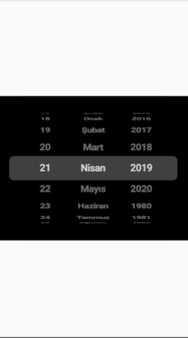

# date_time_picker_tr

A new Flutter package project.

## Screenshots


## Usage

[Example](https://github.com/taylanyildiz/date_time_picker_tr/tree/main/example/example.dart)

To use this package :

* add the dependency to your [pubspec.yaml](https://github.com/taylanyildiz/date_time_picker_tr/blob/main/pubspec.yaml) file.

```yaml
  dependencies:
    flutter:
      sdk: flutter
    date_time_picker_tr:
```

### How to use

```dart
/*
    Here we have minDate , maxDate and initialDate
*/
DatePicker(
    maxDate: DateTime.parse('2020-10-13'),
    minDate: DateTime.parse('1980-10-13'),
    initialDate: DateTime.parse('2019-09-30'),
    onChangedDate: (dateTime) => print(dateTime),
    overlayColor: Colors.grey,
    backgroundColor: Colors.black,
    textColor: Colors.white,
    height: 300.0,
    width: 100.0,
),
```


## Getting Started

This project is a starting point for a Dart
[package](https://flutter.dev/developing-packages/),
a library module containing code that can be shared easily across
multiple Flutter or Dart projects.

For help getting started with Flutter, view our 
[online documentation](https://flutter.dev/docs), which offers tutorials, 
samples, guidance on mobile development, and a full API reference.
